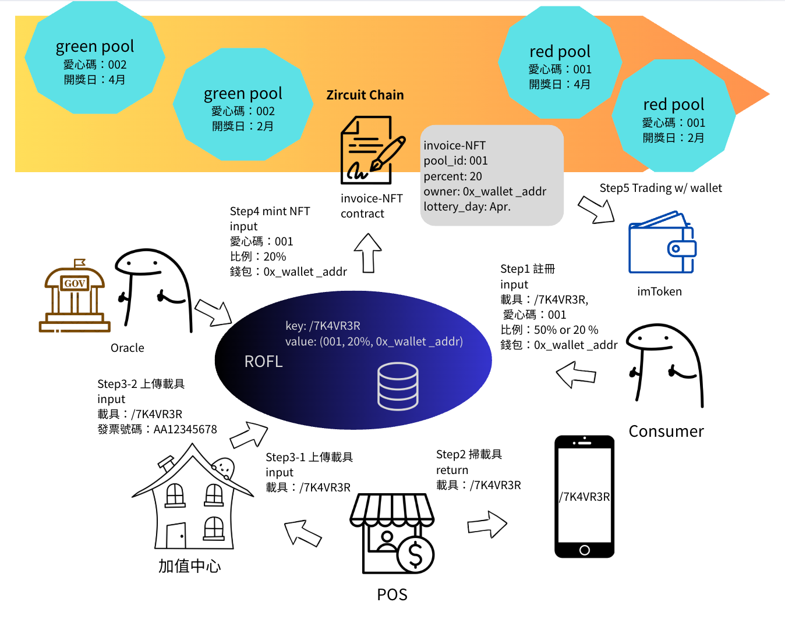
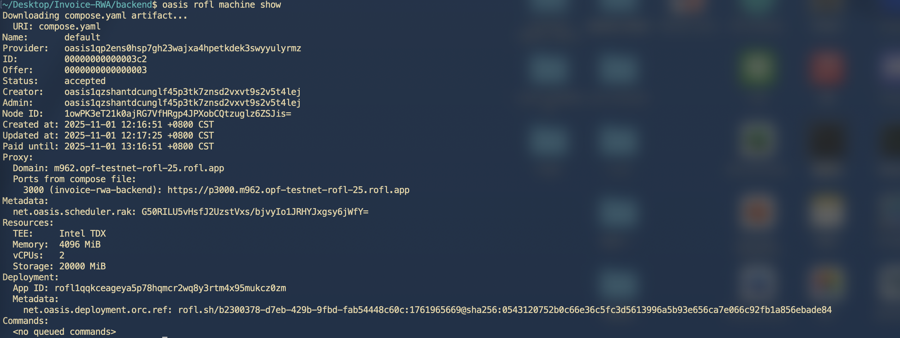

# Invoice-RWA

## Introduction

Notion: https://www.notion.so/Receipt-fi-2991ef2ef38180d2908ec020e30edaba?source=copy_link (Mandarin)

## Architecture Overview



This system employs a dual-chain architecture that combines the security features of both Zircuit and Oasis ROFL:

**[Zircuit](https://www.zircuit.com/) - Smart Contract Layer**

- Hosts core smart contracts:
  - InvoiceTokenV2: https://explorer.garfield-testnet.zircuit.com/address/0x93Ed785884143334cb44ac06d72F9A51cfEFce63
  - PoolV2: https://explorer.garfield-testnet.zircuit.com/address/0xfF66e84852ad81446E0410bDc486edE8CBDAB6Db
- Leverages Zircuit's security mechanisms to protect contracts from malicious actors attempting to mint unauthorized tokens or steal donations
- Ensures on-chain asset and transaction security

**[Oasis ROFL](https://docs.oasis.io/build/rofl/) - Backend Service Layer**

- Runs encrypted backend services within a TEE (Trusted Execution Environment)
- Protects sensitive user registration data (wallet addresses, carrier numbers, etc.)
- Utilizes [Authenticated Transaction](https://docs.oasis.io/build/rofl/features/appd) mechanism to ensure the authenticity and integrity of data sources
- Acts as a trusted Oracle during lottery draws, securely notifying smart contracts of winning results
- Deployment on Sapphire: https://explorer.oasis.io/testnet/sapphire/rofl/app/rofl1qr8sku6hdlqrld8af8k939nk0ls7w3jz8g95f24h



## Backend

### Core Features

#### 1. User Management

- Register users (bind wallet, carrier number, select pool and donation percentage)
- Query and update user settings

#### 2. Invoice Management

- Register invoices and auto-mint NFTs (ERC-1155)
- Batch invoice processing
- Query user invoices and lottery results

#### 3. Relayer Service

- Gasless NFT minting for users
- Monitor relayer wallet balance

#### 4. Oracle Service

- Fetch lottery results from government API
- Notify smart contracts with winning information
- Scheduled task: Process lottery results daily at 2 AM

#### 5. Prize Distribution

- Listen to `LotteryResultNotified` events on-chain
- Auto-calculate and batch distribute rewards (push mode)

### Tech Stack

- Express.js - Web framework
- SQLite - Database (for ROFL TEE deployment)
- ethers.js v6 - Blockchain interaction
- Winston - Logging
- node-cron - Task scheduling

### API Endpoints

#### Health Check

- `GET /health` - System health status

#### User Management

- `POST /api/users/register` - Register user
- `GET /api/users/:walletAddress` - Get user info
- `PUT /api/users/:walletAddress` - Update user settings

#### Pool Management

- `GET /api/pools` - Get all registered pool IDs
- `GET /api/pools/:poolId` - Get data for a specific pool
- `POST /api/pools/register` - Register a new pool (Admin only, requires signature)
- `POST /api/pools/:poolId/withdraw` - Withdraw donations from a pool (Beneficiary only, requires signature)
- `PUT /api/pools/:poolId/beneficiary` - Update a pool's beneficiary address (Admin only, requires signature)
- `PUT /api/pools/:poolId/min-donation-percent` - Update a pool's minimum donation percentage (Beneficiary only, requires signature)
- `DELETE /api/pools/:poolId` - Deactivate a pool (Admin only, requires signature)

#### Invoice Management

- `POST /api/invoices/register` - Register single invoice
- `GET /api/lottery-results?lottery_date=YYYY-MM-DD` - Query lottery results (internal API)

#### Rewards API

- `GET /api/rewards/:walletAddress/:tokenTypeId` - Get claimable reward for a user and token type
- `POST /api/rewards/claim` - Claim reward for a user (User or Operator, requires signature)

#### Token API

- `GET /api/tokens/:tokenTypeId` - Get data for a specific token type
- `GET /api/tokens/:tokenTypeId/drawn` - Check if a token type has been drawn

#### Admin API

- `PUT /api/admin/token-uri` - Set the token URI for the InvoiceToken contract (Admin only, requires signature)
- `PUT /api/admin/pool-contract` - Set the Pool contract address (Admin only, requires signature)

#### Oracle API

- `POST /api/oracle/process-lottery` - Manually process lottery results with winning numbers

### Testing

The project includes a comprehensive, self-contained integration test script that resets the database, runs the server, and executes a suite of API tests.

#### Prerequisites

1. **Install Dependencies**: Ensure all Node.js dependencies are installed:

   ```bash
   npm install
   ```

2. **Environment Variables**: For full test coverage, including tests for admin and beneficiary-only endpoints, you must have a `.env` file in the `backend` directory with the following variables set:
   ```env
   ADMIN_PRIVATE_KEY=0x...
   BENEFICIARY_PRIVATE_KEY=0x...
   ```
   If these keys are not provided, tests requiring valid signatures will be skipped.

#### Running the Tests

To run the entire test suite, simply execute the `test-api.sh` script from the `backend` directory:

```bash
./test-api.sh
```

The script will automatically:

1. Kill any old server processes.
2. Reset the SQLite database to a clean state.
3. Start the backend server in the background.
4. Wait for the server to become healthy.
5. Run all API tests.
6. Shut down the server and provide a summary of test results.

For ROFL deployment testing, run:

```bash
./test-rofl-api.sh
```

The test suite includes:

- Validation of missing required fields
- Validation of invalid date formats
- Validation of invalid prize numbers (not 8 digits)
- Valid lottery processing with sample winning numbers

#### Expected Failures in Local Environment

When running tests locally, it is **normal and expected** for tests that interact with the ROFL (Oasis Runtime Off-chain Logic) service to fail. This is because a local `rofl-appd` instance is not available.

Specifically, the following test will fail:

- **Invoice Registration**: This test attempts to mint an NFT by submitting a transaction to the ROFL service, which will not be reachable, resulting in a connection error.

These failures confirm that the backend is correctly attempting to communicate with the ROFL service.

**Example with API Key:**

```javascript
// In oracle.js route
router.post("/process-lottery", async (req, res) => {
  // Verify API key
  const apiKey = req.headers["x-api-key"];
  if (apiKey !== process.env.ORACLE_API_KEY) {
    return res.status(403).json({ error: "Unauthorized" });
  }
  // ... rest of the code
});
```

### Using the ROFL API

After deploying to ROFL, your backend is accessible via HTTPS. Get your endpoint with:

```bash
oasis rofl machine show
```

Your API will be available at: `https://p3000.m<machine-id>.<region>.rofl.app`

#### Example API Calls

Replace `localhost:3000` with your ROFL endpoint:

```bash
# Health check
curl https://p3000.m961.opf-testnet-rofl-25.rofl.app/health

# Register user
curl -X POST https://p3000.m961.opf-testnet-rofl-25.rofl.app/api/users/register \
  -H "Content-Type: application/json" \
  -d '{"walletAddress": "0x...", "carrierNumber": "12345678", "poolId": 1, "donationPercent": 20}'

# Get user invoices
curl https://p3000.m961.opf-testnet-rofl-25.rofl.app/api/invoices/user/0x...
```

### ROFL Deployment Guide

#### Initial Deployment

Follow these steps to deploy your backend to ROFL (Runtime Off-chain Logic):

##### 1. Initialize ROFL Configuration

```bash
cd backend
oasis rofl init
```

This creates the initial `rofl.yaml` configuration file.

##### 2. Create ROFL App Registration

```bash
oasis rofl create
```

This registers your ROFL application on-chain and assigns an App ID.

##### 3. Build ROFL Container

```bash
docker run --platform linux/amd64 --volume .:/src ghcr.io/oasisprotocol/rofl-dev:main oasis rofl build
```

This builds your application container for the TEE (Trusted Execution Environment).

##### 4. Configure Secrets

Set all required environment variables as secrets:

```bash
# V2 Contract addresses (recommended for new deployments)
echo -n "0xYOUR_INVOICE_TOKEN_V2_ADDRESS" | oasis rofl secret set INVOICE_TOKEN_V2_ADDRESS - --force
echo -n "0xYOUR_POOL_V2_ADDRESS" | oasis rofl secret set POOL_V2_ADDRESS - --force

# Admin credentials (for admin operations like pool registration)
echo -n "0xYOUR_ADMIN_PRIVATE_KEY" | oasis rofl secret set ADMIN_PRIVATE_KEY - --force
echo -n "0xYOUR_ADMIN_ADDRESS" | oasis rofl secret set ADMIN_ADDRESS - --force

# Relayer credentials (for gasless transactions)
echo -n "0xYOUR_RELAYER_PRIVATE_KEY" | oasis rofl secret set RELAYER_PRIVATE_KEY - --force
echo -n "0xYOUR_RELAYER_ADDRESS" | oasis rofl secret set RELAYER_ADDRESS - --force

# Oracle credentials (for lottery results)
echo -n "0xYOUR_ORACLE_PRIVATE_KEY" | oasis rofl secret set ORACLE_PRIVATE_KEY - --force
echo -n "0xYOUR_ORACLE_ADDRESS" | oasis rofl secret set ORACLE_ADDRESS - --force

# Beneficiary address (for receiving donations)
echo -n "0xYOUR_BENEFICIARY_ADDRESS" | oasis rofl secret set BENEFICIARY_ADDRESS - --force

# Chain configuration
echo -n "48898" | oasis rofl secret set CHAIN_ID - --force
```

**Note**: The following are automatically set by `compose.yaml` and don't need to be configured as secrets:

- `NODE_ENV=production`
- `PORT=3000`
- `DB_TYPE=sqlite`
- `DB_PATH=/rofl/storage/invoice_rwa.db`
- `ZIRCUIT_RPC_URL` (uses `ZIRCUIT_TESTNET_RPC_URL`)

##### 5. Deploy to ROFL

```bash
oasis rofl deploy
```

This deploys your application to a ROFL machine.

##### 6. Get Your Endpoint

```bash
oasis rofl machine show
```

Your API will be available at:

```
https://p3000.m<machine-id>.<region>.rofl.app
```

##### 7. Verify Deployment

```bash
# Test health endpoint (replace with your actual URL from step 6)
curl https://p3000.m<machine-id>.<region>.rofl.app/health

# Expected response:
# {"status":"ok","timestamp":"2025-10-31T..."}
```

#### Updating Existing ROFL Deployment

When you\'ve made code changes and want to deploy the updated version:

```bash
docker build --no-cache --platform linux/amd64 -t ghcr.io/<your-github-account>/invoice-rwa-backend:latest .
docker push ghcr.io/<your-github-account>/invoice-rwa-backend:latest
oasis rofl machine restart --wipe-storage
```

This restarts your ROFL machine with the new container image.

## Frontend

### Run Locally

**Prerequisites:** Node.js

1. Install dependencies:
   `npm install`
2. Run the app:
   `npm run dev`
