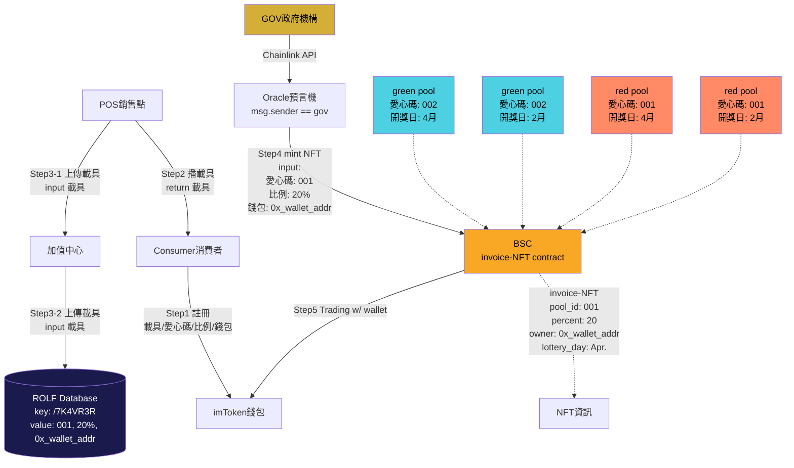

# Invoice-RWA

This graph is just a placeHolder.

```mermaid
graph TB
    Consumer[Consumer消費者] -->|Step1 註冊<br/>載具/愛心碼/比例/錢包| imToken[imToken錢包]
    
    POS[POS銷售點] -->|Step2 播載具<br/>return 載具| Consumer
    
    POS -->|Step3-1 上傳載具<br/>input 載具| TopUp[加值中心]
    TopUp -->|Step3-2 上傳載具<br/>input 載具| ROLF[(ROLF Database<br/>key: /7K4VR3R<br/>value: 001, 20%, 0x_wallet_addr)]
    
    GOV[GOV政府機構] -->|Chainlink API| Oracle[Oracle預言機<br/>msg.sender == gov]
    
    Oracle -->|Step4 mint NFT<br/>input:<br/>愛心碼: 001<br/>比例: 20%<br/>錢包: 0x_wallet_addr| BSC[BSC<br/>invoice-NFT contract]
    
    BSC -.->|invoice-NFT<br/>pool_id: 001<br/>percent: 20<br/>owner: 0x_wallet_addr<br/>lottery_day: Apr.| NFTInfo[NFT資訊]
    
    BSC -->|Step5 Trading w/ wallet| imToken
    
    GreenPool1[green pool<br/>愛心碼: 002<br/>開獎日: 4月] -.-> BSC
    GreenPool2[green pool<br/>愛心碼: 002<br/>開獎日: 2月] -.-> BSC
    RedPool1[red pool<br/>愛心碼: 001<br/>開獎日: 4月] -.-> BSC
    RedPool2[red pool<br/>愛心碼: 001<br/>開獎日: 2月] -.-> BSC
    
    style ROLF fill:#1a1a4d,color:#fff
    style BSC fill:#f9a825,color:#000
    style GOV fill:#d4af37,color:#000
    style GreenPool1 fill:#4dd0e1,color:#000
    style GreenPool2 fill:#4dd0e1,color:#000
    style RedPool1 fill:#ff8a65,color:#000
    style RedPool2 fill:#ff8a65,color:#000
```